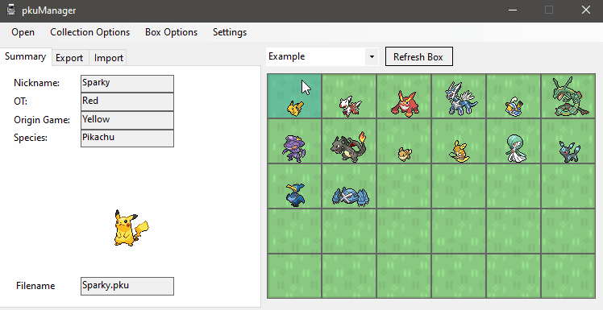

  

pkuManager is a Pokémon storage system that aims to enable the cross-compatibility of all Pokémon games (official or not) via a universal Pokémon storage format (.pku).

  

## The .pku Standard
.pku is a universal and extensible storage format for Pokémon. Generalizing the myraid of existing and, crucially, incompatible Pokémon formats (e.g. pk3, .pk4, .txt, etc).
The purpose of this format is both to serve as a common link between formats, as well as provide a general means of storing Pokémon regardless of their origin.

### Implementation
Under the hood, .pku files are just json files that may or may not have specific tags (e.g. `"Level"`, `"Species"`, etc). Different formats may use these different tags upon export. If a .pku file doesn't have a particular required tag, pkuManager will come up with a default value depending on what format it is being exported to. 

## Check-in and Check-out
When a Pokémon is checked-out to a particular format, say .pk3, it will be marked as such in pkuManager. Only the data relevant to the .pk3 format will be used, with the underlying .pku file remaining in your .pku collection. Checked-out Pokémon can not be checked-out again until they are checked-in.

Once a Pokémon is checked back in, pkuManager will convert the checked-in file, in this case a .pk3, to a .pku file and compare it to the underlying .pku. Once the user confirms any changes (e.g. level went up, new move learned, etc.) pkuManager will merge the changes and mark the Pokémon as checked-in, allowing it to be check-out once again.

It is in this way that pkuManager enables cross-compatibility of Pokémon between all supported formats in a lossless manner.
